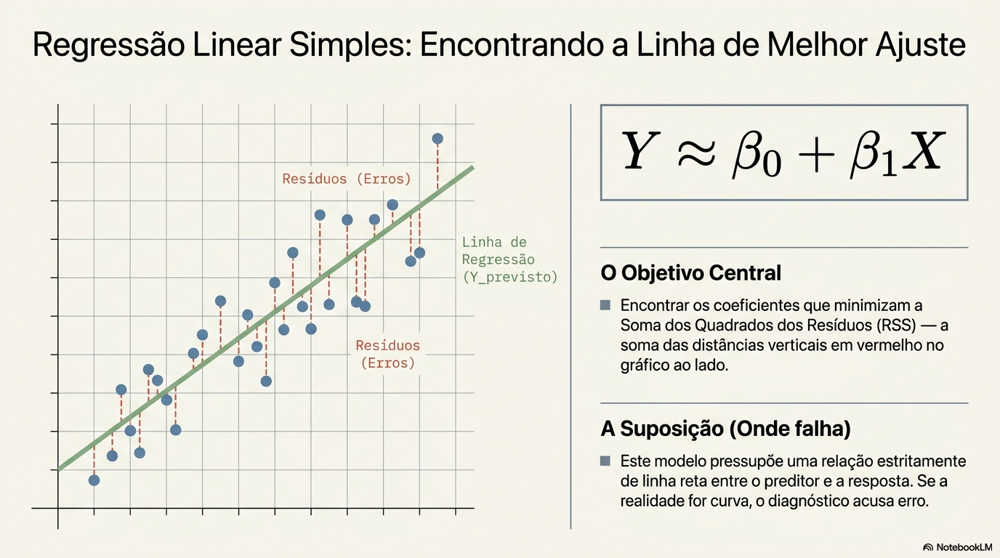
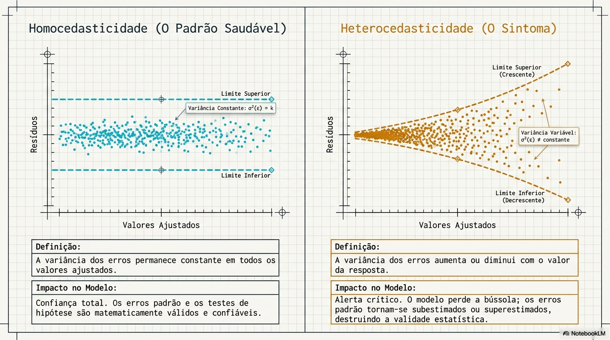
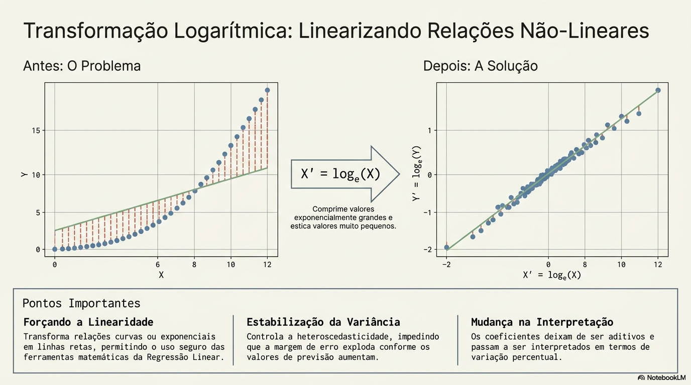
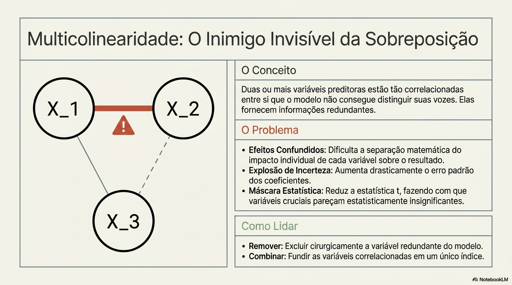
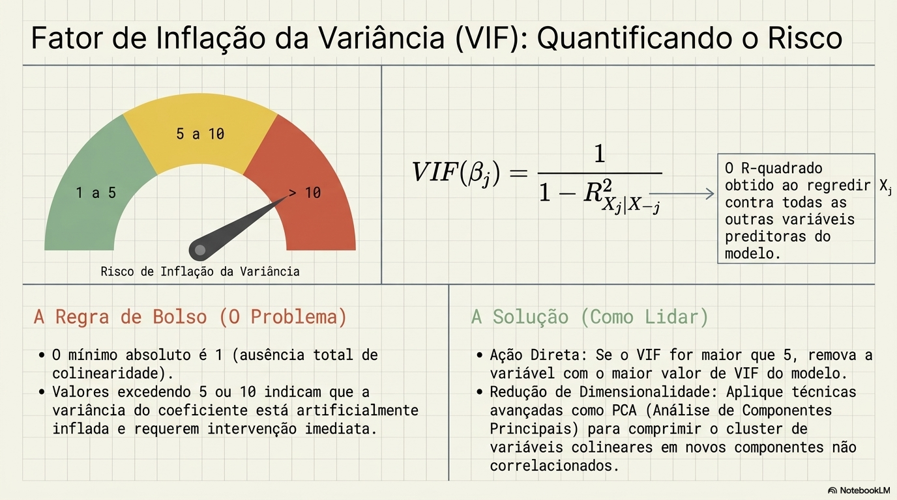

# Modelos Lineares

O conceito dos métodos lineares, como a regressão linear simples e múltipla, baseia-se na premissa de que existe uma relação aproximadamente em linha reta entre as variáveis preditoras (X) e a variável de resposta (Y),. Matematicamente, esses métodos modelam a resposta como uma combinação linear de coeficientes e preditores, servindo como uma ferramenta fundamental para predição e inferência estatística.

Premissas Fundamentais
Para que os modelos lineares sejam válidos e eficazes, assume-se que:
- Linearidade: A relação entre os preditores e a resposta é retilínea, o que significa que a mudança na resposta por unidade de variação no preditor é constante.
- Homocedasticidade: Os termos de erro possuem uma variância constante, não variando sistematicamente com os valores dos preditores ou da resposta.
- Baixa Multicolinearidade

Vantagens
- Interpretabilidade: São modelos extremamente fáceis de explicar e entender, permitindo identificar claramente quais variáveis estão associadas à resposta e a força dessa associação.
- Eficiência e Simplicidade: São computacionalmente baratos para ajustar e servem como um excelente ponto de partida antes de tentar métodos mais complexos.
- Competitividade: 
    - Baixo custo computacional
    - Rapido
    - Funciona bem com poucos dados

Desvantagens
- Rigidez (Alto Viés): A suposição de linearidade é frequentemente uma simplificação excessiva da realidade; se a relação real for complexa ou curva, o modelo terá um viés alto e baixa precisão,.
- Problemas em Alta Dimensionalidade: Quando o número de preditores (p) é grande em relação ao número de observações (n), o modelo pode sofrer de overfitting (sobreajuste); se p>n, o método de mínimos quadrados nem sequer possui uma solução única.
- Sensibilidade a Dados Atípicos: O ajuste pode ser drasticamente distorcido por outliers (valores incomuns na resposta) ou pontos de alta alavancagem (valores incomuns nos preditores).
- MultiColinearidade: Quando os preditores são altamente correlacionados entre si, torna-se difícil separar os efeitos individuais de cada variável, aumentando a incerteza das estimativas.

Como lidar com as desvantagens
- Tecnicas de regularização
- Transformação Log
- Remoção de Outliers

---
# Pontos cobertos pelo questionario abaixo:
- Premissas da Regressão Linear ✅
- Como identificar Homocedasticidade/ Heterocedasticidade ✅
- Transformação Logarítmica ✅
- Diferenças entre Regressão Linear x Regressão Logistica ✅
- Multicolinearidade ✅
- Calculo de VIF ✅
- Tecnicas de Regularização: Lasso (L1), Ridge (L2) e Elastic Net ✅
- Por que modelos Lineares precisam de Normalização dos Dados ✅

---
# Perguntas e respostas:

## Em regressão linear, quais são as principais premissas do modelo e o que acontece se elas forem violadas?
A regressão linear assume algumas premissas importantes.
1. Linearidade, ou seja, a relação entre as variáveis independentes e a variável alvo deve ser aproximadamente linear nos parâmetros.
2. Independência dos erros, ou seja, os resíduos não devem estar correlacionados entre si.
3. Homocedasticidade, que significa que a variância dos erros deve ser constante ao longo dos valores previstos.
4. Normalidade dos resíduos, que é importante principalmente para inferência estatística.
5. Ausência de multicolinearidade forte entre as variáveis explicativas, pois isso pode tornar os coeficientes instáveis.
6. Quando essas premissas são violadas, podemos ter problemas como coeficientes não confiáveis, pior generalização ou inferências incorretas.

## O que é Heterocedasticidade x Homocedasticidade?
Esses conceitos estão relacionados ao comportamento dos resíduos (erros) do modelo. Homocedasticidade significa que os resíduos possuem variância constante ao longo das predições do modelo, enquanto heterocedasticidade ocorre quando essa variância muda. 

Em regressão linear isso impacta principalmente a inferência estatística, porque os erros padrão, p-values e intervalos de confiança passam a ficar incorretos. O modelo ainda pode prever bem, mas a interpretação estatística dos coeficientes fica comprometida.

Homocedasticidade
- A homocedasticidade acontece quando os resíduos possuem variância constante ao longo das predições.
- O erro do modelo permanece relativamente estável;
- A dispersão dos resíduos não aumenta nem diminui conforme o valor previsto muda.

Heterocedasticidade
- A heterocedasticidade acontece quando a variância dos resíduos muda ao longo das predições.
- Para valores baixos o erro é pequeno;
- Para valores altos o erro cresce muito.

Como podemos detectar:
- Plot de Residuos x Valores preditos. Se formar cone, funil ou aumento gradual da dispersão há indicios de heterocedasticidade

Como tratar:
- Transformação Log
- Remoção de outliers

## Tranformação Logaritmica.
A transformação logarítmica é usada para comprimir valores muito altos, reduzir assimetria e estabilizar a variância dos dados. Ela transforma relações multiplicativas em relações mais lineares, ajudando a reduzir heterocedasticidade e aproximar a distribuição de uma normal. É muito usada em variáveis com cauda longa, como renda, faturamento e preços

A ideia intuitiva é:
- diferenças absolutas grandes passam a virar diferenças relativas;
- valores extremos perdem impacto;
- distribuições muito assimétricas ficam mais próximas de uma normal.

Quando NÃO usar log?
- dados já simétricos;
- presença forte de negativos;
- quando interpretabilidade linear é importante;
- modelos de árvore normalmente precisam menos disso.

Impacto na interpretação do Modelo:
- Sem log: Aumento unitário é linear
- Com Log: Interpretação vira percentual/ aproximadamente multiplicativa. Um aumento no coeficiente passa a representar mudança percentual aproximada.

## Qual a diferença entre regressão linear e regressão logística, e por que não podemos usar regressão linear para classificação?
A regressão linear modela uma relação linear entre as variáveis independentes e a variável alvo, estimando valores contínuos e minimizando o erro quadrático médio.

Já a regressão logística é usada para classificação e modela a probabilidade da classe usando a função logística, ou sigmoide, garantindo que a saída fique entre 0 e 1.

Não usamos regressão linear para classificação porque ela pode prever valores menores que 0 ou maiores que 1, o que não faz sentido para probabilidades. Além disso, a função de custo da regressão linear não é adequada para problemas de classificação.

A regressão logística utiliza máxima verossimilhança e log loss, o que torna o modelo mais adequado para estimar probabilidades e tomar decisões de classificação.

## O que é multicolinearidade e por que ela é um problema em modelos lineares?
Multicolinearidade ocorre quando duas ou mais variáveis explicativas são altamente correlacionadas entre si, ou seja, carregam informação redundante.

Em modelos lineares isso é um problema porque dificulta a estimação dos coeficientes, tornando-os instáveis e sensíveis a pequenas variações nos dados. Isso aumenta a variância do modelo e prejudica a interpretabilidade, pois fica difícil separar o efeito individual de cada variável.

Técnicas como regularização L1 e L2 ajudam a reduzir esse problema, penalizando os coeficientes e estabilizando o modelo.

## Como validar multicolinearidade com calculo de VIF?
O VIF é uma métrica usada para detectar multicolinearidade entre variáveis explicativas em modelos lineares. Ele mede o quanto a variância de um coeficiente está sendo “inflada” por causa da correlação entre preditores.

O VIF é uma métrica usada para medir multicolinearidade entre variáveis explicativas. Ele avalia o quanto a variância de um coeficiente está inflada devido à correlação com outras features. Valores altos de VIF indicam que a variável pode ser fortemente explicada pelas demais, tornando os coeficientes instáveis e prejudicando principalmente a interpretação estatística do modelo.

Como Tratar variaveis correlacionadas:
- Remoção de uma das variaveis com alta correlação
- Criar uma feature unica: Combinando features muito correlacionadas
- Utilizar tecnica de PCA

Limitação importante do VIF
- funciona principalmente para modelos lineares;
- avalia relação linear entre features;
- não captura relações não lineares complexas.

## Lasso x Ridge
L1 e L2 são técnicas de regularização usadas para evitar overfitting penalizando os coeficientes do modelo.

Na regularização L1, também chamada de Lasso, a penalização é feita pela soma dos valores absolutos dos coeficientes. Isso pode fazer com que alguns coeficientes se tornem exatamente zero, o que permite seleção automática de variáveis e gera modelos mais esparsos.

Na regularização L2, chamada Ridge, a penalização é feita pela soma dos quadrados dos coeficientes. Nesse caso os coeficientes são reduzidos, mas dificilmente zerados, o que ajuda a lidar melhor com multicolinearidade e melhora a estabilidade do modelo.

Em geral usamos L1 quando queremos seleção de variáveis ou temos alta dimensionalidade, e L2 quando queremos reduzir overfitting e lidar com variáveis correlacionadas.

## Como a regularização L1 e L2 ajudam a evitar overfitting em modelos lineares?
A regularização é usada para evitar overfitting em modelos lineares, porque ela adiciona uma penalização na função de custo, fazendo com que os coeficientes não fiquem muito altos.

Quando o modelo tem coeficientes muito grandes, ele tende a se ajustar demais aos dados de treino, aumentando a variância e perdendo capacidade de generalização.

A regularização L2 penaliza os coeficientes, reduzindo eles para valores próximos de zero, mas sem zerar, o que ajuda a controlar a complexidade do modelo.

Já a regularização L1 também penaliza, mas pode zerar alguns coeficientes, funcionando como uma forma de seleção de variáveis e ajudando quando temos multicolinearidade.

O nível de penalização é controlado por um hiperparâmetro, geralmente chamado de lambda ou alpha, que define o quanto o modelo vai ser regularizado.
- Alpha: Define quanto o modelo penaliza coeficientes grandes. A ideia é evitar overfitting, impedindo que os coeficientes cresçam demais para se ajustar perfeitamente aos dados de treino.

## Por que L1 (Lasso) pode zerar coeficientes e L2 (Ridge) não?
L1 pode zerar coeficientes porque usa penalização absoluta, que cria uma região de solução com cantos nos eixos, fazendo com que alguns coeficientes sejam exatamente zero.

Já o L2 usa penalização quadrática, que apenas reduz os coeficientes, mas dificilmente os leva exatamente a zero.

Por isso o Lasso pode fazer seleção de variáveis, enquanto o Ridge apenas reduz a magnitude dos coeficientes.

## Qual a diferença entre Ridge e Lasso, e quando você usaria cada um?
A Ridge utiliza regularização L2, onde é adicionada uma penalização na soma dos coeficientes ao quadrado na função de custo.
Isso faz com que os coeficientes sejam reduzidos, ficando próximos de zero, mas sem zerar totalmente.

A Ridge é muito usada quando temos multicolinearidade, porque ela estabiliza os coeficientes e reduz a variância do modelo.

Já a Lasso usa regularização L1, onde a penalização é feita com o valor absoluto dos coeficientes.
Isso faz com que alguns coeficientes sejam reduzidos até zero, fazendo seleção automática de variáveis.

Embora a Lasso faça seleção automática de variáveis, a Ridge costuma lidar melhor com multicolinearidade porque ela reduz a variância dos coeficientes sem eliminar completamente variáveis correlacionadas. Em cenários onde várias features carregam sinal parecido, a Ridge tende a distribuir os pesos de forma mais estável, enquanto a Lasso pode escolher uma variável arbitrariamente e descartar outras correlacionadas.

As duas técnicas usam um hiperparâmetro, geralmente chamado de lambda ou alpha, que controla a força da penalização. Quanto maior a penalização, menor a variância, mas maior o viés, então existe um trade-off entre overfitting e underfitting.

## O que acontece com a função de custo quando adicionamos regularização em modelos lineares?
Quando adicionamos regularização em modelos lineares, a função de custo passa a ter não só o erro do modelo, mas também um termo de penalização dos coeficientes. Ou seja, o modelo não tenta apenas minimizar o erro, mas também tenta manter os coeficientes menores, para evitar que o modelo fique muito complexo.

Na regularização L2, a penalização é feita com o quadrado dos coeficientes, fazendo com que eles fiquem próximos de zero.

Já na regularização L1, a penalização é feita com o valor absoluto dos coeficientes, podendo fazer alguns coeficientes ficarem exatamente zero, o que gera seleção de variáveis.

Existe um hiperparâmetro, geralmente chamado lambda ou alpha, que controla a força da penalização. Quanto maior a penalização, menor a variância e maior o viés, então a regularização ajuda a evitar overfitting controlando a complexidade do modelo.

## Por que modelos lineares precisam de normalização, mas árvores normalmente não precisam?
Modelos lineares precisam de normalização porque eles são sensíveis à escala das variáveis.

Quando as variáveis têm magnitudes muito diferentes, como salário e idade, por exemplo, o modelo pode acabar dando mais peso para a variável com valores maiores, porque os coeficientes são calculados levando em conta essa escala.

Além disso, métodos de otimização e regularização, como L1 e L2, também são influenciados pela escala, então a padronização ou normalização ajuda o modelo a convergir melhor e evita distorções.

Já as árvores de decisão não precisam de normalização porque elas não fazem cálculo baseado em distância ou coeficiente, elas apenas testam divisões usando thresholds, como maior ou menor que um valor.

Como a divisão é feita por comparação, a escala da variável não influencia o resultado, então árvores conseguem lidar bem com variáveis em escalas diferentes.